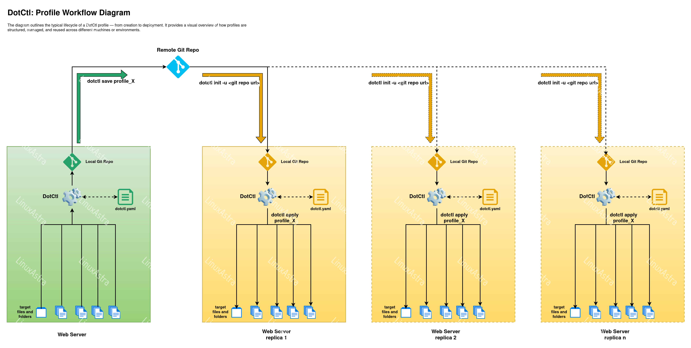

# DotCtl

**dotctl** is a powerful CLI tool to manage, save, apply, export, and import system configurations as named profiles.  
It helps centralize dotfiles and service configurations in Git repositories for seamless replication across systems.

Designed for developers and sysadmins, it supports pre/post hook scripts and is ideal for setting up consistent environments across desktops and servers.

---

## 📚 Table of Contents

- [DotCtl](#dotctl)
  - [📚 Table of Contents](#-table-of-contents)
  - [🚀 Features](#-features)
  - [📁 Profile Config Structure (`dotctl.yaml`)](#-profile-config-structure-dotctlyaml)
    - [🧠 Concept Overview](#-concept-overview)
    - [🗝 Available Path Keys](#-available-path-keys)
    - [✅ Example: Minimal Config](#-example-minimal-config)
    - [💻 Real World: Full Ubuntu + KDE Config](#-real-world-full-ubuntu--kde-config)
    - [📦 Profile Usage Flow (e.g., nginx)](#-profile-usage-flow-eg-nginx)
  - [🔄 Profile Workflow Diagram](#-profile-workflow-diagram)
  - [📊 Profile Block Table](#-profile-block-table)
  - [🔁 Example Workflow Table](#-example-workflow-table)
  - [🔧 Installation](#-installation)
  - [📘 Usage](#-usage)
  - [🛠️ Commands](#️-commands)
    - [📁 `init`](#-init)
    - [💾 `save`](#-save)
    - [📋 `list` / `ls`](#-list--ls)
    - [🔀 `switch` / `sw`](#-switch--sw)
    - [🆕 `create` / `new`](#-create--new)
    - [❌ `remove` / `rm` / `delete` / `del`](#-remove--rm--delete--del)
    - [🧪 `apply`](#-apply)
    - [🔄 `pull`](#-pull)
    - [🔍 `status`](#-status)
    - [🔎 `diff`](#-diff)
    - [📤 `export`](#-export)
    - [📥 `import`](#-import)
    - [🔥 `wipe`](#-wipe)
  - [⚠️ Limitations \& Notes](#️-limitations--notes)
  - [🧑‍💻 Development \& Publishing](#-development--publishing)
    - [Setup Development Environment](#setup-development-environment)
    - [Test the new code](#test-the-new-code)
    - [Build the Package](#build-the-package)
    - [Publish to TestPyPI](#publish-to-testpypi)
    - [Publish to PyPI](#publish-to-pypi)
  - [🙋 Contact](#-contact)

---

## 🚀 Features

- 📦 **Profile Management** — Create, switch, save, remove, and apply system profiles.
- 🌀 **Pre/Post Hooks** — Run scripts before or after activating a profile (e.g., install packages, restart services).
- 🔄 **Git Integration** — Sync profiles with local or remote Git repositories.
- 📁 **Portable Configs** — Export/import profiles using `.dtsv` files for easy backups and sharing.
- ⚙️ **Custom Configs** — Define tracking rules via `dotctl.yaml`.
- 🧹 **Prune Support** — Clean stale files no longer listed in your profile with --prune.

---

## 📁 Profile Config Structure (`dotctl.yaml`)

The `dotctl.yml` config file defines what files and directories to **track**, **save**, and **export** as part of a system profile. This enables seamless migration, sharing, and restoration of system configs and personalizations—perfect for dotfiles, apps, or entire setups like KDE.

### 🧠 Concept Overview

The config has two main sections:

- **`save`**:  
   Specifies config files or directories that should be version-controlled (typically small files like dotfiles).  
   These are **committed to Git** and restored via `dotctl apply`.
- **`export`**:  
   For large or non-versioned files (like fonts, themes, or binaries) that **shouldn't go into Git**, but you still want to package and move using `dotctl export`/`import`.  
   This is helpful in offline environments or when syncing across machines.

Each section can define **any number of data blocks**, and every block contains:

- `location`: A base directory (like `$HOME` or `$CONFIG_DIR`).
- `entries`: A list of files/directories to include relative to the `location`.

### 🗝 Available Path Keys

To simplify path definitions, these keys can be used in `location`:

| Key               | Path             |
| ----------------- | ---------------- |
| `$HOME`           | `/home/<user>`   |
| `$APP_DIR`        | `~/.dotctl`      |
| `$CONFIG_DIR`     | `~/.config`      |
| `$SHARE_DIR`      | `~/.local/share` |
| `$BIN_DIR`        | `~/.local/bin`   |
| `$SYS_SHARE_DIR`  | `/usr/share`     |
| `$SYS_CONFIG_DIR` | `/etc`           |

Use them to make profiles portable across systems.

---

### ✅ Example: Minimal Config

```yaml
save:
  configs:
    location: $HOME
    entries:
      - test.txt

export:
  share_folder:
    location: $HOME/.local/share
    entries: []
  home_folder:
    location: $HOME/
    entries: []
```

---

### 💻 Real World: Full Ubuntu + KDE Config

```yaml
save:
  configs:
    location: $CONFIG_DIR
    entries:
      - gtk-2.0
      - gtk-3.0
      - gtk-4.0
      - Kvantum
      - latte
      - dolphinrc
      - konsolerc
      - kcminputrc
      - kdeglobals
      - kglobalshortcutsrc
      - klipperrc
      - krunnerrc
      - kscreenlockerrc
      - ksmserverrc
      - kwinrc
      - kwinrulesrc
      - plasma-org.kde.plasma.desktop-appletsrc
      - plasmarc
      - plasmashellrc
      - gtkrc
      - gtkrc-2.0
      - lattedockrc
      - breezerc
      - oxygenrc
      - lightlyrc
      - ksplashrc
      - khotkeysrc
      - autostart

  app_layouts:
    location: $HOME/.local/share/kxmlgui5
    entries:
      - dolphin
      - konsole

  home_folder:
    location: $HOME/
    entries:
      - .zshrc
      - .p10k.zsh

  sddm_configs:
    location: $SYS_CONFIG_DIR
    entries:
      - sddm.conf.d

export:
  home_folder:
    location: $HOME/
    entries:
      - .fonts
      - .themes
      - .icons
      - .wallpapers
      - .conky
      - .zsh
      - .bin
      - bin

  share_folder:
    location: $SHARE_DIR
    entries:
      - plasma
      - kwin
      - konsole
      - fonts
      - kfontinst
      - color-schemes
      - aurorae
      - icons
      - wallpapers

  root_share_folder:
    location: $SYS_SHARE_DIR
    entries:
      - plasma
      - kwin
      - konsole
      - fonts
      - kfontinst
      - color-schemes
      - aurorae
      - icons
      - wallpapers
      - Kvantum
      - themes

  sddm:
    location: $SYS_SHARE_DIR/sddm
    entries:
      - themes
```

---

### 📦 Profile Usage Flow (e.g., nginx)

For a service like **nginx**, your profile might:

- `save:` files like `/etc/nginx/nginx.conf`, `/etc/nginx/sites-*`
- Include a **pre-hook** to install nginx (`apt-get install -y nginx`)
- Use a **post-hook** to reload the service (`systemctl reload nginx`)

---

## 🔄 Profile Workflow Diagram

This diagram shows the typical lifecycle of using a `dotctl` profile, from saving configs to applying them on another machine:



```js
            ┌──────────────┐
            │  dotctl.yml  │
            └──────┬───────┘
                   │
         ┌─────────▼──────────┐
         │  `save` Section    │  ◄──── Config Files
         └────────┬───────────┘
                  │
         ┌────────▼───────────┐
         │  dotctl save       │
         └────────┬───────────┘
                  │
                  ▼
         Push to Git Repository
                  │
                  ▼
        ┌─────────────────────┐
        │  Transfer to New PC │
        └────────┬────────────┘
                 │
         ┌───────▼──────────┐
         │  dotctl apply    │
         └───────┬──────────┘
                 │
     ┌───────────▼────────────┐
     │ Pre-hook (e.g. install)│
     └───────────┬────────────┘
                 ▼
     Apply saved config files
                 │
  ┌──────────────▼─────────────────┐
  │ Post-hook (e.g. restart/reload)│
  └────────────────────────────────┘

                 │
                 ▼
        ┌─────────────────────┐
        │     dotctl export   │
        └────────┬────────────┘
                 ▼
          Create `.dtsv` file
                 │
        Transfer `.dtsv` file
                 ▼
        ┌─────────────────────┐
        │     dotctl import   │
        └─────────────────────┘
```

---

## 📊 Profile Block Table

| Section  | Field      | Description                                                       |
| -------- | ---------- | ----------------------------------------------------------------- |
| `save`   | `location` | Base path of the tracked files (can use key like `$CONFIG_DIR`)   |
|          | `entries`  | List of files/folders to track under that location                |
| `export` | `location` | Base path of export files (e.g., large assets not suited for Git) |
|          | `entries`  | List of assets or binaries to package in `.dtsv`                  |

---

## 🔁 Example Workflow Table

| Action          | Command                | Description                                                 |
| --------------- | ---------------------- | ----------------------------------------------------------- |
| Save configs    | `dotctl save`          | Pulls files defined in `save` and stores in repo            |
| Export assets   | `dotctl export`        | Package large, non-Git assets into `.dtsv` file             |
| Transfer assets | `scp profile.dtsv ...` | Manually copy to another machine                            |
| Import assets   | `dotctl import`        | Unpack `.dtsv` on another system                            |
| Apply profile   | `dotctl apply`         | Pull from repo, run pre/post hooks, and apply saved configs |

---

## 🔧 Installation

```sh
pip install dotctl
```

---

## 📘 Usage

```sh
dotctl [OPTIONS] <COMMAND> [ARGS]
```

Run `dotctl -h` for global help or `dotctl <COMMAND> -h` for command-specific help.

---

## 🛠️ Commands

### 📁 `init`

Initialize a new profile.

```sh
dotctl init [-h] [-u <git-url>] [-p <profile>] [-c <config-path>] [-e <env>]
```

**Examples:**

```sh
dotctl init -e kde
dotctl init -u https://github.com/user880/dots.git -p mydesktop
dotctl init -c ./my_custom_config.yaml
```

**Options:**

- `-e, --env` – Target environment (e.g., kde, gnome, server).
- `-u, --url` – Git URL to clone profile from.
- `-p, --profile` – Activate this profile after init.
- `-c, --config` – Path to custom YAML config.

---

### 💾 `save`

Save current system state to the active profile.

```sh
dotctl save [-h] [-p <password>] [--skip-sudo] [--prune] [profile]
```

**Examples:**

```sh
dotctl save
dotctl save my_web_server --skip-sudo
dotctl save my_web_server -p mYsecretp@ssw0rd
dotctl save --prune
```

> Tip: Use --prune to clean files that were saved before but are no longer listed in the config.

**Options:**

- `--skip-sudo` – Ignore restricted resources.
- `-p, --password` – Password for restricted resources.
- `--prune` – Remove stale files from the dot repo that are no longer listed in the current `dotctl.yaml` config.
- `profile` – Target profile to save into (defaults to the active one if not provided)

---

### 📋 `list` / `ls`

List all profiles.

```sh
dotctl list [-h] [--details] [--fetch]
```

**Examples:**

```sh
dotctl list
dotctl list --details
dotctl list --fetch
```

**Options:**

- `--details` – Show extended info.
- `--fetch` – Refresh remote data.

---

### 🔀 `switch` / `sw`

Switch to another profile.

```sh
dotctl switch [-h] [--fetch] [profile]
```

**Examples:**

```sh
dotctl switch MyProfile
dotctl sw MyProfile --fetch
```

**Options:**

- `--fetch` – Refresh profile info before switching.

---

### 🆕 `create` / `new`

Create a new, empty profile.

```sh
dotctl create [-h] [--fetch] [-c <path>] [-e <env>] profile
```

**Examples:**

```sh
# Create a new profile from current active profile.
dotctl create myserver

# Create a empty new profile from a specific environment.
dotctl create -e kde

# Create a empty new profile from a custom config.
dotctl create -c ./my_custom_config.yaml
```

**Options:**

- `--fetch` – Sync with remote before creating.
- `-c, --config` – Path to custom YAML config.
- `-e, --env` – Target environment (e.g., kde, gnome, server).

---

### ❌ `remove` / `rm` / `delete` / `del`

Remove a profile locally and/or remotely.

```sh
dotctl remove [-h] [-y] [--fetch] <profile>
```

**Examples:**

```sh
dotctl rm MyProfile
dotctl del MyProfile --fetch
dotctl del MyProfile -y
```

**Options:**

- `--fetch` – Refresh data before removal.
- `-y, --no-confirm` – Skip confirmation prompt.

---

### 🧪 `apply`

Apply a saved profile.

```sh
dotctl apply [-h] [-p <password>] [--skip-sudo] [--skip-hooks] [--skip-pre-hooks] [--skip-post-hooks] [--ignore-hook-errors] [--hooks-timeout <timeout>] [profile]
```

**Examples:**

```sh
dotctl apply
dotctl apply mydesktop --skip-hooks
dotctl apply mydesktop --hooks-timeout 10
dotctl apply MyProfile --skip-pre-hooks --ignore-hook-errors
```

**Options:**

- `--skip-sudo` – Ignore restricted resources.
- `--skip-hooks` – Skip all hooks.
- `--skip-pre-hooks` – Skip only pre-hooks.
- `--skip-post-hooks` – Skip only post-hooks.
- `--ignore-hook-errors` – Don’t abort if hooks fail.
- `--hooks-timeout` – Timeout in seconds for hooks.
- `-p, --password` – Password for restricted actions.

---

### 🔄 `pull`

Pull the latest changes from the dotfiles repository.

```sh
dotctl pull [-h]
```

**Examples:**

```sh
dotctl pull
```

---

### 🔍 `status`

Inspect the current profile health and detect configuration drift between the repository and local system.

```sh
dotctl status [--json] [--short]
```

**Examples:**

```sh
dotctl status
dotctl status --short
dotctl status --json
```

---

### 🔎 `diff`

Compare tracked files between the repository and local system.

```sh
dotctl diff [--color] [--side-by-side]
```

**Examples:**

```sh
dotctl diff
dotctl diff --color
dotctl diff --side-by-side
```

---

### 📤 `export`

Export a profile to `.dtsv`.

```sh
dotctl export [-h] [-p <password>] [--skip-sudo] [profile]
```

**Examples:**

```sh
dotctl export
dotctl export my_web_server --skip-sudo
dotctl export my_web_server -p mYsecretp@ssw0rd
```

**Options:**

- `--skip-sudo`, `-p` same as above.

---

### 📥 `import`

Import a `.dtsv` profile.

```sh
dotctl import [-h] [-p <password>] [--skip-sudo] <file.dtsv>
```

**Examples:**

```sh
dotctl import my_web_server.dtsv
dotctl import /data/backup/web.dtsv --skip-sudo
```

**Options:**

- `--skip-sudo`, `-p` same as above.

---

### 🔥 `wipe`

Remove all local profiles.

```sh
dotctl wipe [-h] [-y]
```

**Examples:**

```sh
dotctl wipe
dotctl wipe -y
```

**Options:**

- `-y, --no-confirm` – Do not prompt before wiping.

---

## ⚠️ Limitations & Notes

- Sudo support is currently available only for the `save` command.
- Commands like `status`, `diff`, `apply`, and others may skip restricted files if permissions are insufficient.
- Ensure tracked files/directories have proper read permissions before adding them to `dotctl.yaml`.
- Missing or inaccessible files may appear as drift during `status` or `diff` operations.

---

## 🧑‍💻 Development & Publishing

### Setup Development Environment

```sh
python -m venv venv
source venv/bin/activate  # Linux/macOS
venv\Scripts\activate     # Windows

pip install -r requirements.txt
```

### Test the new code

```sh
cd src
python -m dotctl.main --help
python -m dotctl.main new my_profile
python -m dotctl.main save
python -m dotctl.main apply
```

### Build the Package

```sh
python -m build
```

### Publish to TestPyPI

```sh
twine upload --repository testpypi dist/*
```

### Publish to PyPI

```sh
twine upload --repository pypi dist/*
```

---

## 🙋 Contact

- **Maintainer:** [Pankaj Jackson](https://github.com/pankajackson)
- **Support:** [Open an Issue](https://github.com/pankajackson/dotctl/issues)
